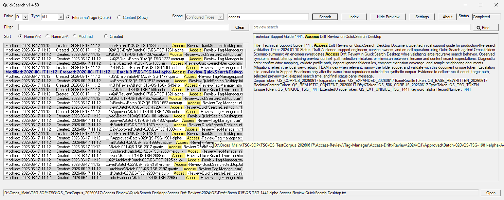
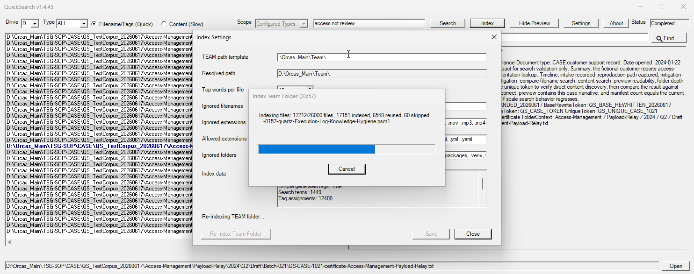

# QuickSearch (QS)

**Version:** v1.4.54
**Date:** 2026-06-19
**Status:** Air-gapped, pure PowerShell desktop search tool for mapped team folders  
**ADC Standard:** 1.1.27  

QuickSearch is built for air-gapped and offline Windows environments. It is written in PowerShell, runs from local files, and does not require third-party libraries, package managers, installers, databases, web services, or cloud services.

QuickSearch helps find files on mapped shared drives. It can search by filename, search generated TEAM tags quickly, scan file contents when needed, preview matched files, and open the selected file.

## Air-Gapped Fit

- Pure PowerShell desktop utility using built-in Windows/.NET capabilities.
- No third-party runtime libraries or external services are required for normal use.
- No internet access is required after the files are present on the target machine.
- Settings, profiles, and generated indexes are local JSON files under `src/`.

## Start

For normal use, double-click:

```text
src\QuickSearch.vbs
```

For debugging from a console:

```powershell
Set-Location D:\Repos\QuickSearch
PowerShell.exe -NoProfile -ExecutionPolicy Bypass -File .\src\QuickSearch.ps1
```

The window title uses the `Version` value from `src/settings/config.json`, for example `QuickSearch v1.4.54`.

## Screenshots





## Main Buttons

- `Search` runs the selected search.
- `Index` opens TEAM index settings and includes `Re-Index Team Folder`.
- `Show Preview` / `Hide Preview` toggles the file preview pane.
- `Settings` selects the active runtime profile.
- `About` shows author, contact, and basic usage information.
- `Open` opens the selected result.

Prompts, settings dialogs, and progress windows open centered over the main QuickSearch window.

## Search Modes

- `Filename/Tags (Quick)` is the fast path. For `TEAM`, it uses the generated index manifest at `src/data/index.json` plus shard files under `src/data/index-shards/` when available.
- `Content (Slow)` reads file contents at search time. Use it when you need to find text inside files.
- `Scope` applies to `ALL` live scans. `Configured Types` scans configured folders such as TSG, SOP, and CASE. `All` scans the full selected root.

If TEAM quick search says the index is missing, open `Index` and run `Re-Index Team Folder`.

Search results show modified and created timestamps before each file path. Long paths are shortened with `...` inside the list; hover over a result to see the full path. Use the result `Filter` box above the list to narrow the current results by path text, timestamps, extension, or any displayed term. Filter supports `and`, `or`, `not`, and backtick escape, so `access and report` means both terms while ``access `and report`` searches the word `and` literally. Use the result sort radio buttons to order by `Name A-Z`, `Name Z-A`, `Modified`, or `Created`; date sorts show newest files first.

## Index

The `Index` popup lets you edit:

- document path
- TEAM path
- top words per file
- ignored filenames
- allowed extensions
- ignored extensions
- ignored folders

`Re-Index Team Folder` rebuilds `src/data/index.json` and shard files under `src/data/index-shards/`. The index stores filenames, paths, and generated top-word tags. It does not store full file contents.

The Index popup opens with a quick file-level index summary. Click `Refresh Data` when you need full index counts such as indexed file count, search term count, schema version, shard count, update time, and file size.

## Preview

Selecting a result opens the preview pane automatically. QS previews plain text, Markdown, and HTML files. When the selected file contains the active search keyword, the preview highlights it. Use the preview search box and Find button to highlight a different word or phrase inside the current preview.

## Settings And Profiles

- Main config: `src/settings/config.json`
- Profiles: `src/profiles/*.profile.json`
- Default profile: `src/profiles/default.profile.json`

Profiles are for environment-specific values such as drive letter, document path, TEAM path, and type list. Global search and indexing defaults stay in `src/settings/config.json` unless a profile intentionally overrides them.

Saving path changes from `Index` updates both `src/settings/config.json` and the active profile, so a UI restart keeps the edited document and TEAM paths.

The main config and active profile both store path settings. Profiles can narrow or swap the document and TEAM roots for a specific environment.

## Validation

Run the main smoke test after changing runtime code:

```powershell
Set-Location D:\Repos\QuickSearch
PowerShell.exe -NoProfile -ExecutionPolicy Bypass -File .\tests\smoke-index.ps1
```

Archived helper tools live under `src/tools/`. Only run their smoke tests when those tools change.

## Project Notes

QS is onboarded to ADC under `.adc/`. Before changing code, read `.adc/index.md`, `.adc/prompt-rules.md`, and the relevant scoped standards under `.adc/standards/`.

Generated index files are runtime data. Do not commit secrets, mapped-drive credentials, real ContextGraph credentials, release payloads, or transfer artifacts.
